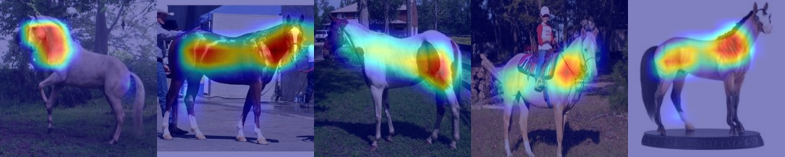
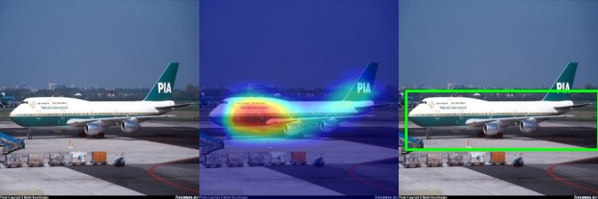

#### Introduction

Deep Descriptor Transforming(**DDT**) is a simple yet effective unsupervised approach for image retrieval. You can read the corresponding paper which is listed in the reference section for deep-in understand the amazing DDT approach.

The code defaults use **VGG19 pretrained network** to extract features from relu5_4 layer on the **GPU** which enabled CUDA , but if GPU is not available, code will seamlessly switch to execute on the CPU.

You can safely modify the source code for academic usage. For example, using **different level of features or pretrained network** to verify the performance of the DDT approach.

#### Example

#### Dependencies

**OpenCV** which is installed from source code is not included in the `requirements.txt`, you can follow the installation note in the `./docs/Install OpenCV4 on ubuntu 18.04 for C++ and Python3.pdf` which written in **chinese**.

#### Usage

> (torch) $ python main.py train

The generated annotation image will be saved in the `data/`、`./data/label/` folders.

#### Reference

- Official guide: [Unsupervised Object Discovery and Co-Localization by Deep Descriptor Transformation](<http://lamda.nju.edu.cn/weixs/project/DDT/DDT.html>).
- X.-S. Wei, C.-L. Zhang, Y. Li, C.-W. Xie, J. Wu, C. Shen, and Z.-H. Zhou. [Deep Descriptor Transforming for Image Co-Localization](http://lamda.nju.edu.cn/weixs/publication/ijcai17.pdf). *In Proceedings of* [*International Joint Conference on Artificial Intelligence (IJCAI’17)*](http://ijcai-17.org/), Melbourne, Australia, 2017, pp. 3048-3054.
- Matlab version for DDT: https://github.com/tzzcl/DDT.
#### LICENSE

CC BY-SA 3.0